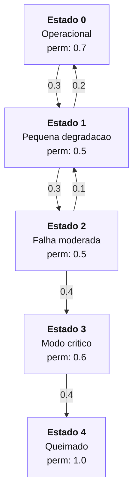
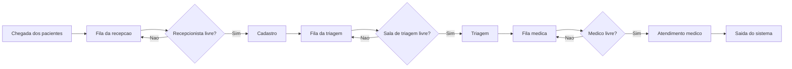

# Trabalho 4 - Cadeias de Markov e ACD

## Questao 1 - Cadeia de Markov absorvente

O sensor possui cinco estados:

- Estado 0: sensor totalmente operacional.
- Estado 1: sensor com pequena degradacao.
- Estado 2: sensor com falha moderada.
- Estado 3: sensor em modo critico.
- Estado 4: sensor queimado.

O estado 4 e absorvente, porque depois que o sensor queima ele permanece nesse estado.

### a) Diagrama de transicao de estados



Observacao: as probabilidades de permanecer no mesmo estado foram colocadas dentro dos blocos para evitar setas de auto-retorno muito grandes.

### b) Matriz de transicao

Usando a ordem dos estados `0, 1, 2, 3, 4`, a matriz de transicao fica:

```text
P =
[ 0.7   0.3   0.0   0.0   0.0 ]
[ 0.2   0.5   0.3   0.0   0.0 ]
[ 0.0   0.1   0.5   0.4   0.0 ]
[ 0.0   0.0   0.0   0.6   0.4 ]
[ 0.0   0.0   0.0   0.0   1.0 ]
```

Cada linha soma 1, pois cada linha representa todas as possibilidades de transicao a partir de um estado.

### c) Probabilidade de falha total exatamente no 4o ciclo

O sensor inicia no estado 0.

Para atingir o estado 4 no 4o ciclo, o caminho direto possivel e:

```text
0 -> 1 -> 2 -> 3 -> 4
```

Multiplicando as probabilidades:

```text
P = 0.3 * 0.3 * 0.4 * 0.4
P = 0.0144
P = 1.44%
```

Portanto, a probabilidade de falha total exatamente no 4o ciclo e:

```text
1.44%
```

### d) Matriz fundamental

Como o estado 4 e absorvente, os estados transientes sao `0, 1, 2, 3`.

A matriz `Q` e formada apenas pelas transicoes entre estados transientes:

```text
Q =
[ 0.7   0.3   0.0   0.0 ]
[ 0.2   0.5   0.3   0.0 ]
[ 0.0   0.1   0.5   0.4 ]
[ 0.0   0.0   0.0   0.6 ]
```

A matriz fundamental e:

```text
N = (I - Q)^(-1)
```

Resultado:

```text
N =
[ 6.1111   4.1667   2.5000   2.5000 ]
[ 2.7778   4.1667   2.5000   2.5000 ]
[ 0.5556   0.8333   2.5000   2.5000 ]
[ 0.0000   0.0000   0.0000   2.5000 ]
```

### e) Numero medio de ciclos ate a absorcao

O numero medio de ciclos ate a absorcao e calculado por:

```text
t = N * 1
```

Resultados:

| Estado inicial | Tempo medio ate absorcao |
|---:|---:|
| 0 | 15.2778 ciclos |
| 1 | 11.9444 ciclos |
| 2 | 6.3889 ciclos |
| 3 | 2.5000 ciclos |

Se o sensor comeca totalmente operacional, o tempo medio ate a falha total e aproximadamente:

```text
15.28 ciclos
```

### f) Probabilidade de absorcao no estado 4

Como existe apenas um estado absorvente e todos os estados transientes conseguem chegar ate ele, a probabilidade final de absorcao no estado 4 e igual a 1 para qualquer estado inicial transiente.

| Estado inicial | Probabilidade de absorcao no estado 4 |
|---:|---:|
| 0 | 1.0000 |
| 1 | 1.0000 |
| 2 | 1.0000 |
| 3 | 1.0000 |

### g) Codigo Python

O notebook da questao 1 contem o codigo para:

- montar a matriz de transicao;
- calcular `P^4`;
- calcular a matriz fundamental;
- calcular o tempo medio ate absorcao;
- simular trajetorias da cadeia;
- mostrar a evolucao temporal das probabilidades.

Arquivo:

```text
questao1/questao1.ipynb
```

## Questao 2 - Sistema ACD do consultorio

O sistema representa um consultorio medico com recepcao, triagem e atendimento medico.

### a) Identificacao do sistema

| Item | Descricao |
|---|---|
| Entidades | Pacientes |
| Recursos | 1 recepcionista, 1 sala de triagem e 2 medicos |
| Filas | Fila da recepcao, fila da triagem e fila medica |
| Eventos | Chegada, fim de cadastro, fim de triagem e fim de consulta |
| Variaveis de estado | Relogio, tamanho das filas, estado dos recursos e pacientes em atendimento |

### b) Diagrama ACD



### c) Fases A, B e C

| Fase | Funcao |
|---|---|
| Fase A | Avanca o relogio para o proximo evento |
| Fase B | Executa eventos incondicionais |
| Fase C | Inicia atividades condicionais quando existe recurso livre |

Na Fase A, o relogio da simulacao vai para o instante do proximo evento.

Na Fase B, ocorrem eventos como chegada de paciente, fim de cadastro, fim de triagem e fim de consulta.

Na Fase C, o sistema verifica se existe paciente esperando e recurso disponivel. Se existir, a proxima atividade e iniciada.

### d) Dinamica da simulacao

A atualizacao do relogio ocorre sempre indo para o menor tempo futuro de evento.

Quando um servidor termina uma atividade, o paciente avanca para a proxima fila ou sai do sistema.

Depois disso, o sistema verifica se algum recurso esta livre.

Se houver recurso livre e fila com paciente, o proximo paciente inicia atendimento.

### e) Tabela manual preenchida

Tempos entre chegadas:

```text
[5, 7, 3, 10, 6]
```

Chegadas acumuladas:

```text
[5, 12, 15, 25, 31]
```

Tabela:

| Paciente | Chegada | Inicio Cadastro | Fim Cadastro | Inicio Triagem | Fim Triagem | Inicio Consulta | Fim Consulta |
|---:|---:|---:|---:|---:|---:|---:|---:|
| 1 | 5 | 5 | 9 | 9 | 15 | 15 | 27 |
| 2 | 12 | 12 | 17 | 17 | 22 | 22 | 40 |
| 3 | 15 | 17 | 20 | 22 | 29 | 29 | 39 |
| 4 | 25 | 25 | 29 | 29 | 33 | 39 | 59 |
| 5 | 31 | 31 | 37 | 37 | 43 | 43 | 58 |

### f) Medidas de desempenho

Tempo medio na fila da recepcao:

```text
(0 + 0 + 2 + 0 + 0) / 5 = 0.40 min
```

Tempo medio na fila medica:

```text
(0 + 0 + 0 + 6 + 0) / 5 = 1.20 min
```

Tempo medio total no sistema:

```text
(22 + 28 + 24 + 34 + 27) / 5 = 27.00 min
```

Taxa de utilizacao dos medicos:

```text
Tempo total de consulta = 12 + 18 + 10 + 20 + 15 = 75 min
Tempo disponivel dos medicos = 2 * 59 = 118 min
Utilizacao = 75 / 118 = 0.6356 = 63.56%
```

Numero medio de pacientes no sistema:

```text
Area sob N(t) = 135
Tempo total = 59 min
Numero medio = 135 / 59 = 2.29 pacientes
```

## Observacao sobre os arquivos

Os notebooks continuam como apoio computacional:

```text
questao1/questao1.ipynb
questao2/questao2.ipynb
```

Este arquivo Markdown pode ser convertido para PDF pelo VS Code.
